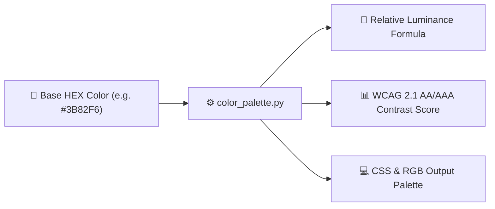

<div align="center">

# 🚀 color-palette-cli

### *Terminal color palette generator & WCAG 2.1 contrast checker.*

[](https://github.com/TauqeerMustafa/color-palette-cli/actions)
[](LICENSE)
[](https://www.python.org/)
[](color_palette_cli.py)
[](CONTRIBUTING.md)

<br/>

<p align="center">
  <a href="#-why-use-color-palette-cli">Why color-palette-cli?</a> •
  <a href="#-instant-preview">Demo</a> •
  <a href="#-quick-start">Quick Start</a> •
  <a href="#-architecture">Architecture</a> •
  <a href="#-cli-reference">CLI Reference</a> •
  <a href="#-contributing">Contributing</a> •
  <a href="#-license">License</a>
</p>

</div>

---

## 💡 Why Use `color-palette-cli`?

- **WCAG Accessibility**: Calculates precise contrast ratios against white (#FFF) and black (#000).
- **RGB & HEX Conversion**: Converts hex codes to clean RGB tuples and luminance scores.
- **Design Ready**: Quickly verify UI color accessibility before writing stylesheets.

---

## 🎬 Instant Preview

```bash
$ python color_palette.py "#3B82F6"
============================================================
🎨 COLOR PALETTE & WCAG REPORT FOR #3B82F6
============================================================
HEX Code         : #3B82F6
RGB Values       : (59, 130, 246)
------------------------------------------------------------
Contrast on White (#FFF) : 3.47:1 ➔ ❌ FAIL (WCAG AA requires 4.5:1)
Contrast on Black (#000) : 6.05:1 ➔ ✅ PASS (WCAG AA compliant)
============================================================
```

---

## ⚡ Quick Start

```bash
# 1. Clone the repository
git clone https://github.com/TauqeerMustafa/color-palette-cli.git
cd color-palette-cli

# 2. Run CLI tool immediately (No pip install required)
python color_palette_cli.py --help
```

---

## 🏛️ Architecture & Workflow



---

## 💻 CLI Reference

| Command | Description |
| :--- | :--- |
| `python color_palette_cli.py --help` | Display full help menu and flag options |
| `python color_palette_cli.py` | Run default execution mode |

---

## 🤝 Contributing

Contributions, feature suggestions, and pull requests are warmly welcomed!
- Read our [Contributing Guidelines](CONTRIBUTING.md).
- Follow our [Code of Conduct](CODE_OF_CONDUCT.md).

---

## 📄 License

Distributed under the **MIT License**. See [`LICENSE`](LICENSE) for details.

<div align="center">
  <sub>Crafted with ❤️ for the open-source community by <a href="https://github.com/TauqeerMustafa">Tauqeer Mustafa</a>.</sub>
</div>
